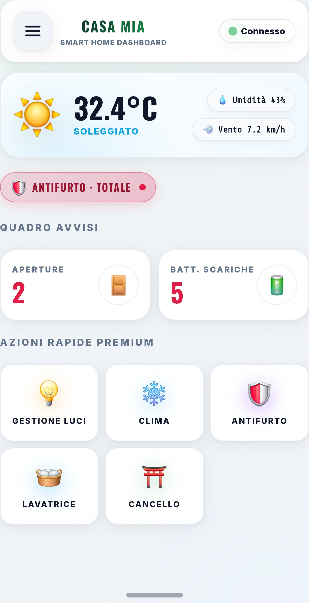
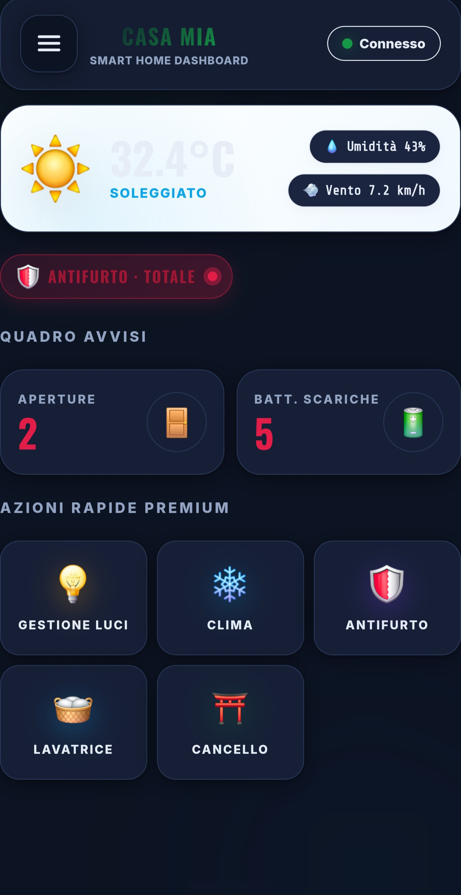
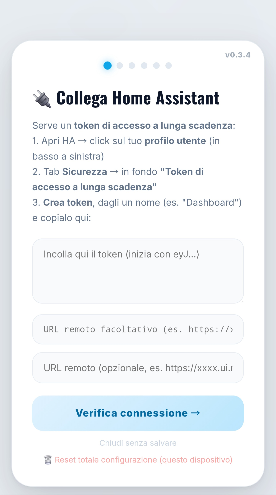
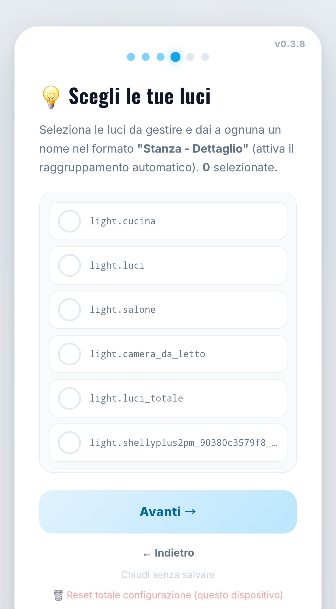
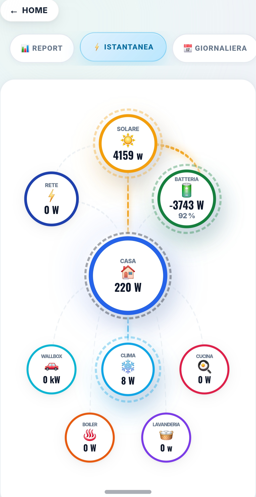
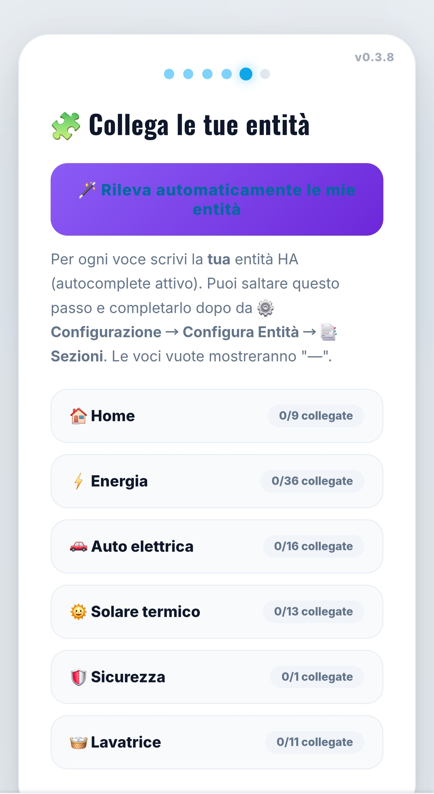
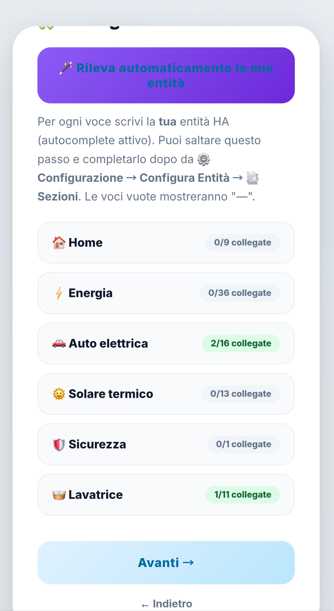

<div align="center">

# 🏠 Dashboard Modern

### La dashboard per Home Assistant che si configura da sola — e si personalizza all'infinito

*A self-configuring, endlessly customizable Home Assistant dashboard* 🇬🇧

<br>


[](https://paypal.me/giovannidaniello15)

<br>



<br>

**Un solo file HTML · Zero card custom · Zero YAML · Configurazione 100% guidata**

[📦 Installazione](#-installazione-in-3-minuti) · [🪄 Auto-configurazione](#-il-setup-wizard-con-auto-rilevamento) · [🖼️ Screenshot](#%EF%B8%8F-le-sezioni) · [☕ Supporta](#-supporta-il-progetto)

</div>

---

## ✨ Perché Dashboard Modern?

<table>
<tr>
<td width="50%" valign="top">

### 🪄 Si configura da sola
Premi **"Rileva automaticamente"** e la dashboard legge il tuo Home Assistant: clima, telecamere, stanze, sensori, avvisi — tutto proposto in automatico. Tu correggi solo dove serve. **Da zero a dashboard completa in 60 secondi.**

### 👻 Mostra solo ciò che hai
Niente card vuote o trattini: ciò che non configuri **sparisce**. 8 sezioni attivabili e rinominabili, elementi illimitati (luci, stanze, clima, camere, azioni rapide).

</td>
<td width="50%" valign="top">

### 🔄 Si aggiorna da sola
Update da HACS → la dashboard rileva la nuova versione e **si ricarica automaticamente**. La tua configurazione sopravvive sempre.

### 🎨 Bella ovunque
Design "sculpted" moderno, tema **chiaro/scuro/auto**, mobile-first con bottom-nav, grafici storici a popup, animazioni fluide. In **italiano e inglese**.

---

## 🎬 Video tutorial

Dall'installazione alla dashboard configurata, in meno di 2 minuti:

https://github.com/user-attachments/assets/52371288-9070-4111-81ba-69f13ce1dd3f

---
</td>
</tr>
</table>

<div align="center">
&nbsp;&nbsp;

<br><sub>☀️ Tema chiaro · 🌙 Tema scuro (o automatico col sistema)</sub>
</div>

---

## 📦 Installazione in 3 minuti

> **Prerequisito**: [HACS](https://hacs.xyz) installato. *(In alternativa: [installazione manuale](#-installazione-manuale-senza-hacs))*

**1️⃣ Aggiungi il repository** — HACS → menu **⋮** → *Repository personalizzati*:

```
https://github.com/danigio15/dashboardmodern
```
Categoria: **Dashboard**

**2️⃣ Scarica** — cerca **"Dashboard Modern"** in HACS → *Scarica*

**3️⃣ Crea la plancia** — *Impostazioni → Dashboard → Aggiungi* → vista **Pannello** → card **Iframe** con URL:

| Lingua | URL |
|---|---|
| 🇮🇹 Italiano | `/hacsfiles/dashboardmodern/dashboard.html` |
| 🇬🇧 English | `/hacsfiles/dashboardmodern/dashboard-en.html` |

**4️⃣ Aprila** — parte il Setup Wizard 👇

<details>
<summary>📁 <b>Installazione manuale (senza HACS)</b></summary>
<br>

1. Scarica `dashboard.html` (o `dashboard-en.html`) dall'ultima [release](../../releases)
2. Copialo in `/config/www/dashboards/` (File Editor o Samba)
3. Card Iframe con URL `/local/dashboards/dashboard.html`
</details>

---

## 🪄 Il Setup Wizard (con auto-rilevamento)

<div align="center">
&nbsp;&nbsp;

</div>

Sei passi guidati, nessun file da toccare:

1. **🔌 Connessione** — crea il token (istruzioni incluse), verifica live, URL remoto Nabu Casa opzionale
2. **🏠 Nome** — il nome della tua casa nell'intestazione + utente amministratore
3. **📑 Sezioni** — attiva solo quelle che ti servono e **rinominale** ("Auto" → "Tesla")
4. **💡 Luci** — lette dal tuo HA, selezione a tap con raggruppamento automatico per stanza
5. **🧩 Entità** — **premi 🪄 e guarda la magia**: clima, telecamere, stanze, avvisi ed entità proposti automaticamente. Badge "N/M collegate" per ogni sezione. Tutto correggibile con autocomplete.
6. **🎉 Fine** — riepilogo di ciò che hai configurato e via!

> 💡 **Riapri il wizard quando vuoi**: 7 tap veloci sul titolo della Home, oppure `#setup` nell'URL.

---

## 🖼️ Le sezioni

<div align="center">

<br><sub>⚡ La sezione Energia con i flussi animati del fotovoltaico</sub>
</div>
<br>

| Sezione | Cosa offre |
|---|---|
| 🏠 **Home** | Meteo, quadro avvisi (aperture/batterie), stato allarme, azioni rapide personalizzabili |
| ⚡ **Energia** | Flussi fotovoltaico animati, produzione/consumo/batteria/rete, analisi giorno-mese-anno, costi |
| 🚗 **Auto elettrica** | Batteria, autonomia, sessione ricarica, wallbox, modalità EVCC, immagine personalizzabile |
| 🌡️ **Stanze** | Card temperatura/umidità illimitate con grafici storici |
| ❄️ **Clima** | Condizionatori e termosifoni illimitati, controlli e popup dettagliato |
| 🌞 **Solare termico** | Boiler, sonde, pompa |
| 🛡️ **Sicurezza** | Telecamere illimitate (snapshot + live WebRTC/go2rtc), centrale allarme |
| 🖥️ **Server** | CPU/RAM/disco/temperatura, speedtest, connettività |

---

## ⚙️ Personalizzazione totale

<div align="center">
&nbsp;&nbsp;

</div>

La pagina **⚙️ Config** (solo per gli admin che scegli) dà accesso a tutto:

| | |
|---|---|
| 🧙 **Setup Wizard** | Riapre la configurazione guidata completa |
| 🧩 **Configura Entità** | 7 schede: Sezioni · Sostituzioni · Carichi · Avvisi · Testi · Nascondi · Esporta |
| 🎨 **Tema** | Chiaro / Scuro / Auto |


Ogni etichetta è rinominabile, ogni card nascondibile, ogni entità rimappabile. **Semplice per iniziare, senza limiti per personalizzare.**

<details>
<summary>💾 <b>Configurazione multi-dispositivo</b></summary>
<br>

La config vive nel browser del dispositivo. Per condividerla:
- **Export/Import**: ⚙️ → Configura Entità → 📤 Esporta → copia → incolla sull'altro dispositivo
- **Config esterno**: crea `/config/www/casa-dashboard-config.js` da [`config.example.js`](config.example.js) — sopravvive agli update HACS
</details>

<details>
<summary>🆘 <b>Accessi di emergenza</b></summary>
<br>

| Metodo | Come |
|---|---|
| **7 tap** | Tocca 7 volte il titolo nella Home → wizard (vibra al 5°) |
| **#setup** | Aggiungi `#setup` all'URL e ricarica |
| **Reset totale** | In fondo al wizard: riparti da zero |
</details>

---

## 🔄 Aggiornamenti

Update normali da **HACS** → all'apertura successiva la dashboard **si aggiorna da sola** (controllo anche ogni 6h per i tablet a muro). Mai più URL da cambiare o cache da svuotare. La configurazione **sopravvive sempre**.

---

## 🔒 Sicurezza

- Il token dà pieno accesso al tuo HA: **trattalo come una password**
- Token esposto? Revocalo subito dal profilo HA
- Il file distribuito non contiene credenziali né dati di alcuna installazione

---

## ☕ Supporta il progetto

<div align="center">

Dashboard Modern è **gratuita e open source**, sviluppata nel tempo libero.
Se ti è utile e vuoi supportare lo sviluppo di nuove funzionalità:

[](https://paypal.me/giovannidaniello15)

Ogni contributo, anche piccolo, è molto apprezzato! 🙏
E se ti piace, lascia una ⭐ al repo — aiuta il progetto a crescere!


</div>

---

<div align="center">
<sub>

[MIT License](LICENSE) · Sviluppata da **Giovanni d'Aniello** con l'aiuto di Claude (Anthropic) · Grafici [Chart.js](https://www.chartjs.org)

🐛 Problemi o idee? [Apri una issue](../../issues) · 📋 [Changelog completo](CHANGELOG.md)

</sub>
</div>
